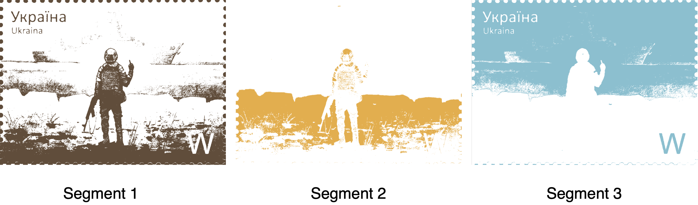

# Example of Image Segmentation Using K-Means

[](https://github.com/pharo-ai/image-segmentation/actions/workflows/test.yml)
[](https://coveralls.io/github/pharo-ai/image-segmentation?branch=master)
[](https://raw.githubusercontent.com/pharo-ai/image-segmentation/master/LICENSE)

Example of image segmentation in [Pharo](https://pharo.org) based on [k-means clustering](https://github.com/pharo-ai/k-means).

## How to install it

To install `image-segmentation`, go to the Playground (Ctrl+OW) in your [Pharo](https://pharo.org/) image and execute the following Metacello script (select it and press Do-it button or Ctrl+D):

```Smalltalk
Metacello new
  baseline: 'AIImageSegmentation';
  repository: 'github://pharo-ai/image-segmentation';
  load.
```

## How to depend on it

If you want to add a dependency on `linear-algebra` to your project, include the following lines into your baseline method:

```Smalltalk
spec
  baseline: 'AIImageSegmentation'
  with: [ spec repository: 'github://pharo-ai/image-segmentation' ].
```

## How to use it

```st
file := 'pharo-local/iceberg/pharo-ai/image-segmentation/img/stamp.jpg' asFileReference.

file binaryReadStreamDo: [ :stream |
  image := ImageReadWriter formFromStream: stream ].
```


```st
segmentator := AIImageSegmentator new
  image: image;
  numberOfSegments: 3;
  yourself.
```

```st
segmentator findPixelClusters.
```

```st
segmentator clusters. "#(2 2 2 2 2 2 2 2 2 2 2 2 2 2 2 2 2 1 1 1 ...etc...)"

segmentator clusterColors. "an OrderedCollection(
  (Color r: 0.5933528836754643 g: 0.7390029325513197 b: 0.8074291300097751 alpha: 1.0)
  (Color r: 0.36656891495601174 g: 0.30596285434995113 b: 0.2375366568914956 alpha: 1.0)
  (Color r: 0.8484848484848485 g: 0.6881720430107527 b: 0.3509286412512219 alpha: 1.0))"
```

```st
segmentator segmentate.
```
```st
segmentator segmentatedImage.
```


```st
segmentator segments.
```


